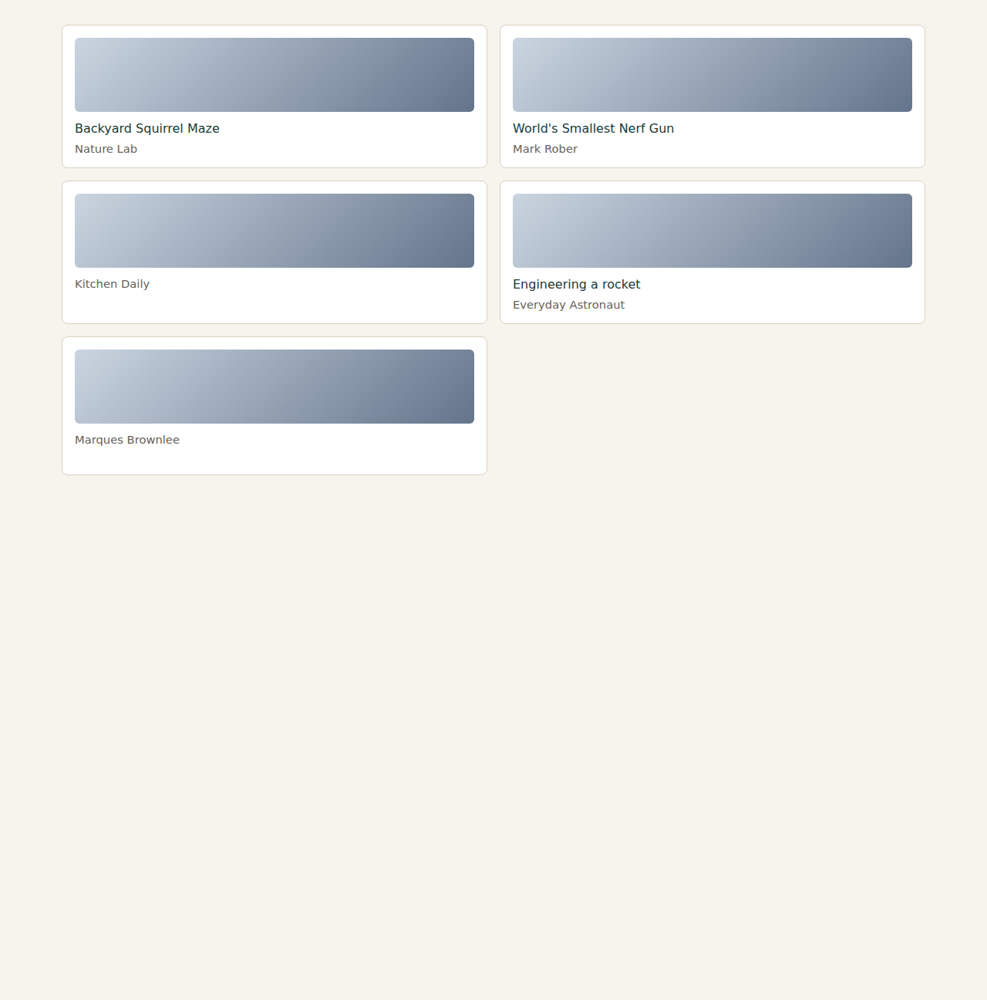
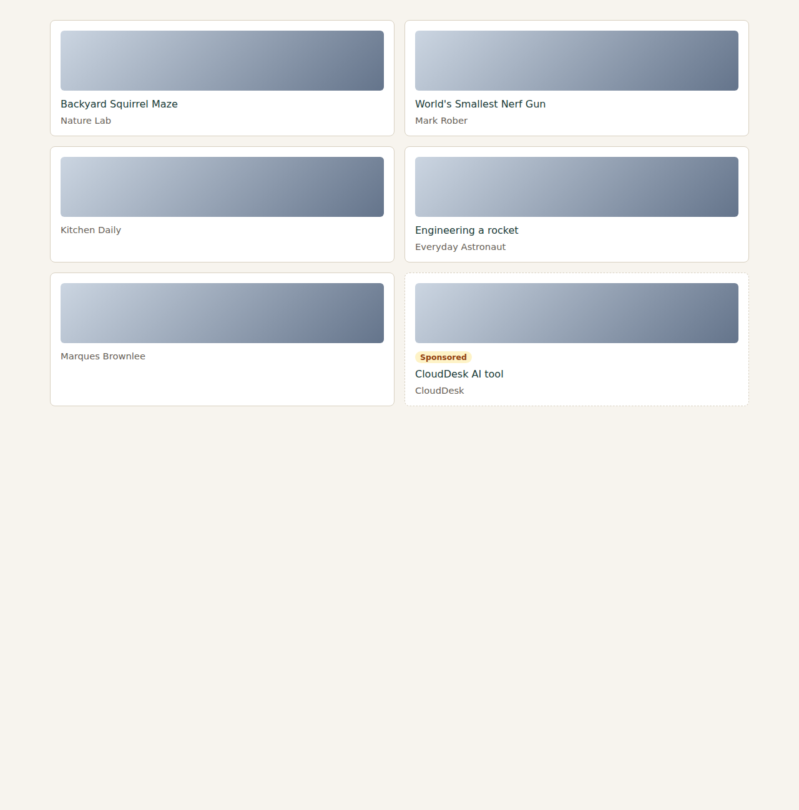
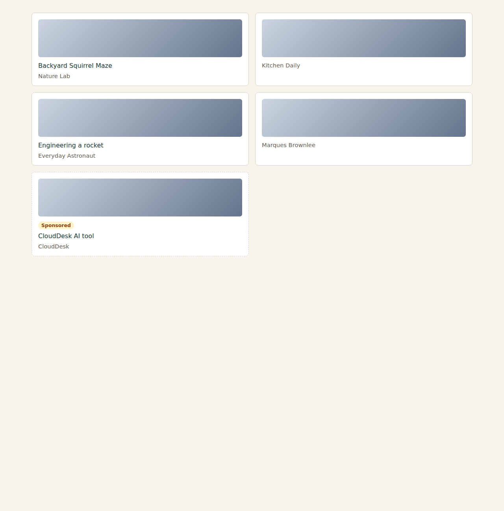
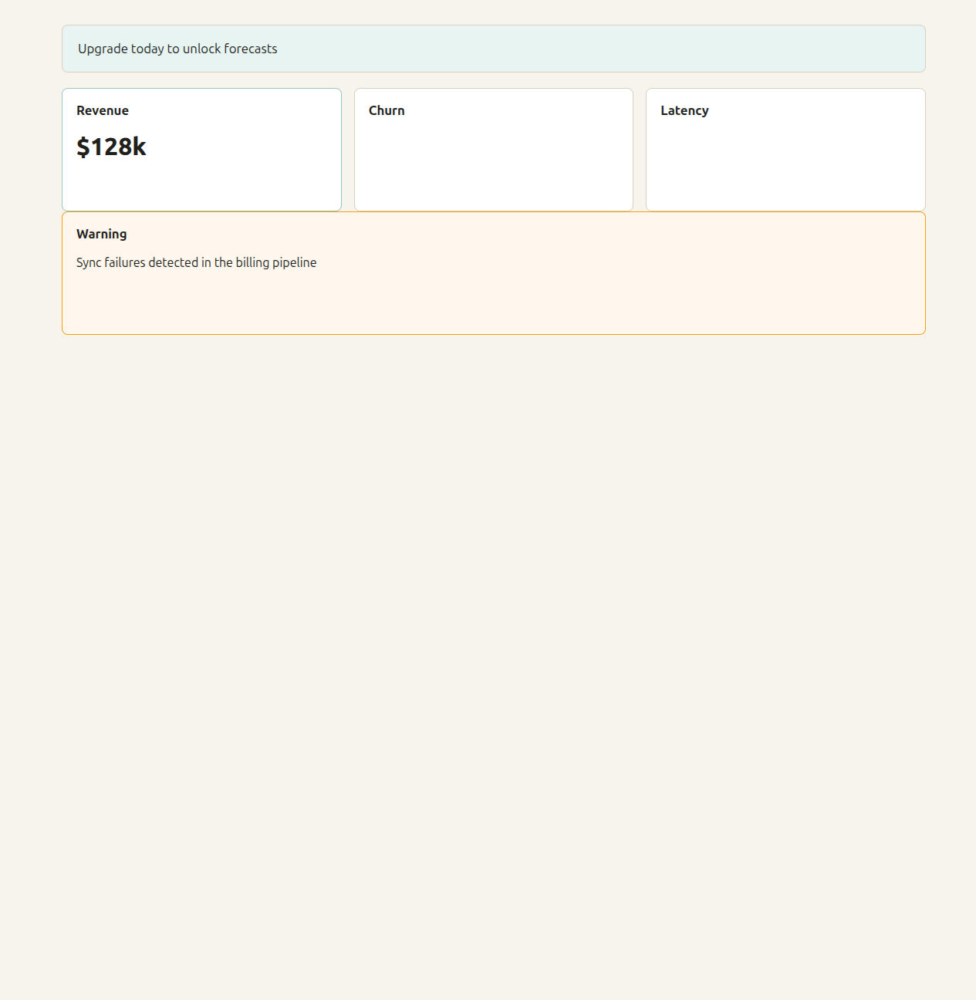
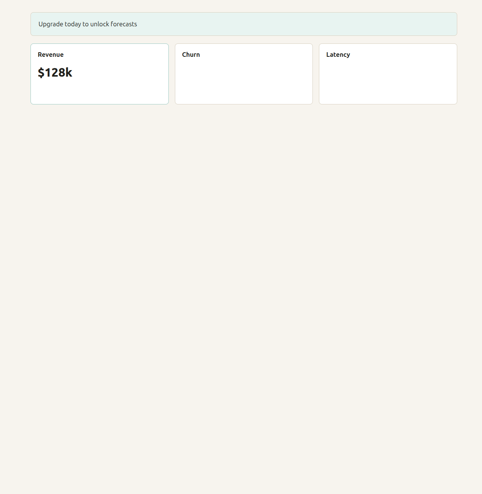
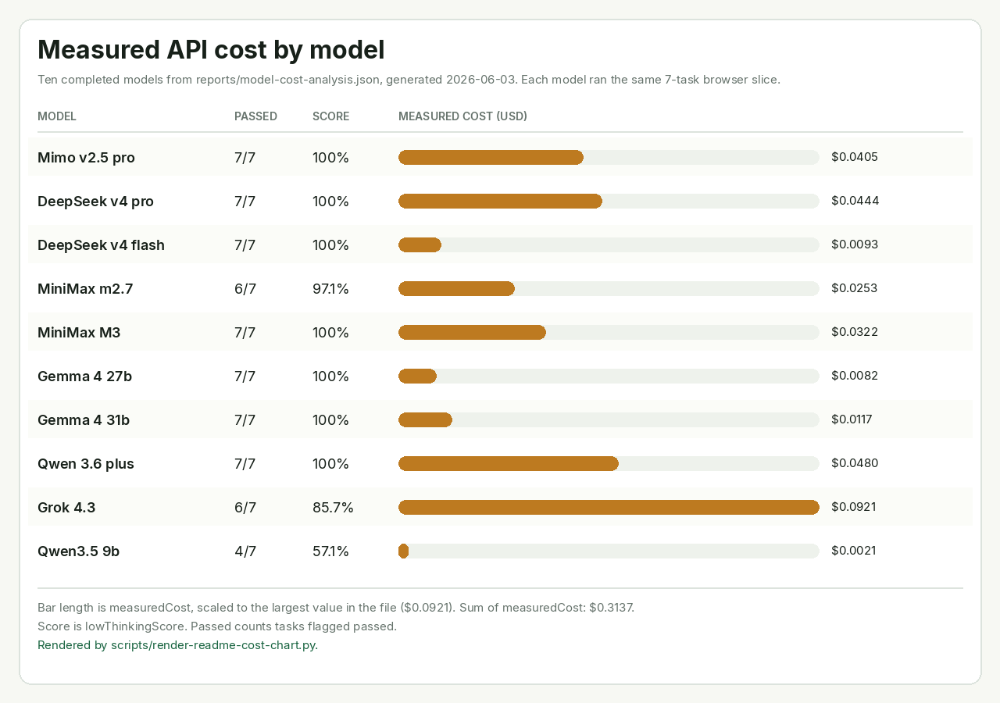

# PX Harness Research

V1 is a dependency-light baseline harness for the current Perso XXL planner.

It does not try to be the final browser harness yet. It creates local structured
web fixtures, sends the same kind of prompt/context that the extension sends to
OpenRouter, validates the returned transform plan, matches selectors against the
fixture DOM, scores deterministic expectations, and writes HTML/JSON reports.

| Before | After |
| --- | --- |
|  |  |

*Task `medium-youtube-hide-sponsored`. The prompt is “I don't want to see sponsored content anymore.” The sponsored card is in the before capture and gone in the after capture. These files are the run stored in [`reports/model-runs/qwen-qwen3-5-9b.json`](reports/model-runs/qwen-qwen3-5-9b.json), which marks this task passed.*

Run:

```sh
npm run baseline
```

Browser-mode baseline:

```sh
npm run baseline:browser
```

Run the browser baseline repeatedly for stability stats:

```sh
npm run baseline:browser -- --runs=10
```

Skip tasks that already meet a previous pass-rate threshold:

```sh
npm run baseline:browser -- --runs=10 --skip-pass-rate=0.9
```

By default the skip decision reads `reports/browser-baseline.json`. Use
`--skip-source=path/to/report.json` to compare against a different baseline.

Run only a focused slice of tasks:

```sh
npm run baseline:browser -- --runs=10 --tags=youtube-focused
npm run baseline:browser -- --tasks=medium-youtube-hide-creator-typo,medium-youtube-hide-creator-exact
```

| Before | After |
| --- | --- |
|  |  |

*Task `medium-youtube-hide-creator-exact`, the exact-name control named in the command above. The prompt is “I don't want to see videos from Mark Rober in my feed.” The Mark Rober card is removed and the other videos stay. Same capture: [`reports/model-runs/qwen-qwen3-5-9b.json`](reports/model-runs/qwen-qwen3-5-9b.json) marks this task passed.*

Run the experimental DOMFS context mode:

```sh
npm run baseline:browser -- --context-mode=domfs --output=reports/domfs-experiment --tags=youtube-focused
```

DOMFS v1 adds a terminal-like DOM navigation context to the planner: page
outline, find results, local inspections, nearby family, and proposed selectors.
It is intentionally behind a switch because it is not yet a true interactive
tool loop; the runner precomputes the navigation trace before the model call.
Use `--block-fixture-selectors=true` to remove benchmark-only `[data-uid]`
selectors from generated plans and test whether the approach transfers better
to real pages.

| Before | After |
| --- | --- |
|  |  |

*Task `medium-dashboard-hide-warning`. The prompt is “Hide the warning about sync failures.” The warning card is removed and the other metric cards stay. Captured in [`reports/domfs-no-fixture-experiment.json`](reports/domfs-no-fixture-experiment.json) (`deepseek/deepseek-v4-flash`, DOMFS context, `blockFixtureSelectors` on). That report marks this task passed.*

Browser mode starts the local web-zoo app, launches Chromium or Chrome, runs low-reasoning
tasks, applies plans to actual DOM pages, captures before/after screenshots, and
writes `reports/browser-baseline.html` plus `reports/browser-baseline.json`. The
HTML report includes a human review table with task intent, screenshots,
pass/fail state, failure reason, semantic target candidates, selector diagnostics,
and expandable per-task logs.

The runner prefers `/snap/bin/chromium`, then other Chromium paths, then
Google Chrome. If the selected browser cannot load unpacked extensions, it
falls back to injecting Perso's DOM/executor scripts into the fixture pages and
using the Node OpenRouter planner. That fallback still tests real browser DOM
execution, but not extension loading.

The runner reads the OpenRouter key from `OPENROUTER_API_KEY`, `PERSO_XXL_DIR`,
the sibling `../Perso-XXL/config/env.js`, or `../Perso-XXL/.env`.

## Measured model cost



*Measured API cost, pass count, and score for the ten models in [`reports/model-cost-analysis.json`](reports/model-cost-analysis.json) (generated 2026-06-03). Bar length is `measuredCost`. Score is `lowThinkingScore`. Passed counts tasks flagged passed, out of 7. The same rows are in [`reports/model-cost-analysis.html`](reports/model-cost-analysis.html). Regenerate the figure with `python3 scripts/render-readme-cost-chart.py`.*
